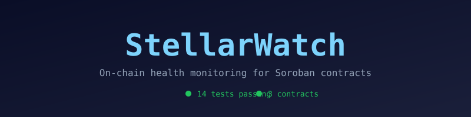

# StellarWatch Contracts

On-chain health monitoring and alerting infrastructure for the Stellar ecosystem.

## Overview
gamp@gamp-HP-EliteBook-840-G8-Notebook-PC:~/Music/stellarwatch-contract$ gh repo view WideForgeLabs/stellarwatch-contract --json visibility,url,description
{
  "description": "Soroban contracts for StellarWatch, on-chain health monitoring",
  "url": "https://github.com/WideForgeLabs/stellarwatch-contract",
  "visibility": "PUBLIC"
}
gamp@gamp-HP-EliteBook-840-G8-Notebook-PC:~/Music/stellarwatch-contract$ 

StellarWatch is an open-source monitoring platform for Soroban smart contracts on the Stellar network. Soroban contracts have TTLs that expire, storage that can drift, and invocation patterns that need watching. No open-source tool exists to monitor these on-chain.

StellarWatch fills this gap by recording health states on-chain via Soroban contracts, creating a verifiable audit trail. Operators configure alert rules stored in contracts, and the platform emits events when thresholds are crossed.

This repository contains the Soroban smart contracts that power the platform.

## Architecture

Three contracts form the core.

### contract-registry

Tracks which contracts are being monitored. Stores metadata per contract: name, version, deployer, registration timestamp, and last health check timestamp.

### health-registry

Records health check results with on-chain timestamping. Each record captures status (Healthy, Degraded, Unhealthy, Unknown), response time, message, and block height. Supports querying history per contract.

### alert-rules

Stores configurable threshold rules for automated alerts. Rules can target specific contracts. Supports pause and resume for maintenance windows.

All contracts implement TTL extension on every persistent write to prevent storage expiration on mainnet. This is a critical requirement for Soroban production deployments.

## Current Status

| Contract | Logic | TTL | Tests |
|----------|:-----:|:---:|:-----:|
| contract-registry | Yes | Yes | 4 |
| health-registry | Yes | Yes | 5 |
| alert-rules | Yes | Yes | 5 |
| Total | | | 14 |

CI runs on every push: format check, clippy, WASM build, tests.

## Repo Structure

- contracts/contract-registry - Contract metadata and registration
- contracts/health-registry - Health check records
- contracts/alert-rules - Alert threshold rules
- shared/ - Shared types and errors
- scripts/deploy.sh - Deploy all three contracts in order
- .github/workflows/ci.yml - CI pipeline

## Requirements

- Rust 1.80 or later
- wasm32-unknown-unknown target
- Stellar CLI for deployment

## Build

Run `cargo build --target wasm32-unknown-unknown --release`

WASM artifacts will be written to target/wasm32-unknown-unknown/release/.

## Test

Run `cargo test --all`

All 14 tests should pass: 4 for contract-registry, 5 for health-registry, 5 for alert-rules.

## Deploy

First, list your Stellar identities with `stellar keys ls`

Then deploy using the identity name:

The script deploys in dependency order: contract-registry, then health-registry, then alert-rules. It prints all three contract IDs at the end.

## Tech Stack

- Rust edition 2021
- soroban-sdk 21.x
- WASM target wasm32-unknown-unknown
- GitHub Actions for CI

## Maintainers

| Name | Role | Contact |
|------|------|---------|
| [@Ikechukwu-Patrick](https://github.com/Ikechukwu-Patrick) | Lead maintainer, contract architect | [Telegram: @IkSunshine](https://t.me/IkSunshine) |
| [@martinifeanyi058-ship-it](https://github.com/martinifeanyi058-ship-it) | Contract engineer, alert-rules | [Telegram: @threalxavier](https://t.me/threalxavier) |

## Community

Join the StellarForge Developers Telegram group for discussions, questions, and updates:

- [StellarForge_Developers on Telegram](https://t.me/StellarForgeDevCodes)

## Contributing

See CONTRIBUTING.md for guidelines.

Open issues are scoped for contributors. See the issues page at https://github.com/WideForgeLabs/stellarwatch-contract/issues

## Security

See SECURITY.md for vulnerability disclosure.

## License

MIT. See LICENSE for details.
